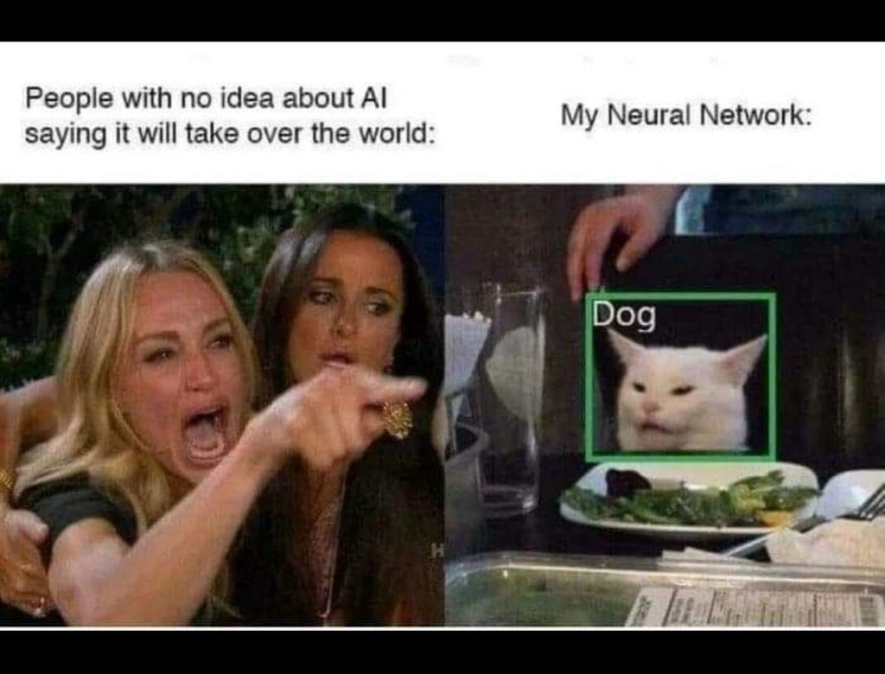
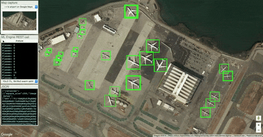
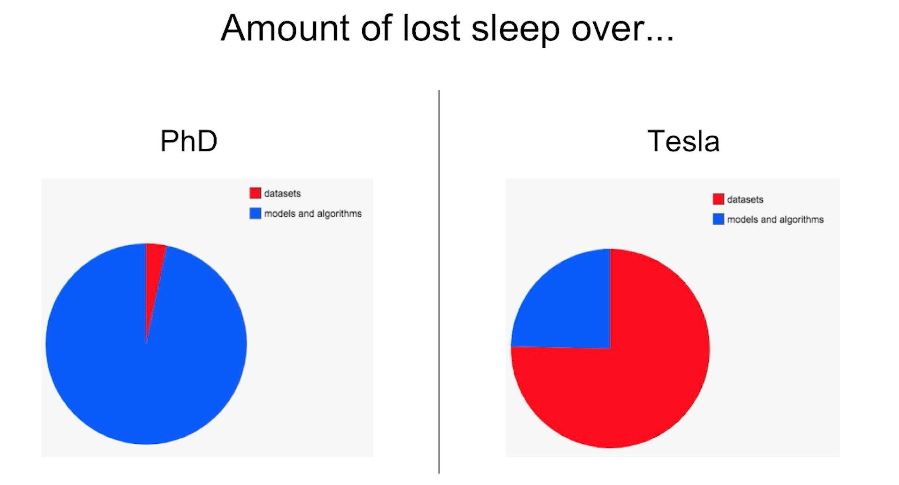

# Deep Learning in Practice
**ISAE-SUPAERO, December 2019**

Florient CHOUTEAU, Matthieu LE GOFF, Marina GRUET

--

6 hours hands on session on applying "deep learning" to a "real" use-case

-- 
## Detect Aircrafts on Satellite Imagery

--

### Who we are

- Computer Vision R&D at Airbus Defence and Space

- Ground segment software for earth observation satellites
- Working daily with Deep Learning on satellite imagery
    - Information extraction (object detection, change detection...)
    - Image processing (clouds, image enhancement)
    - Research stuff (image simulation, self-supervision...)
    

-- 

### Context

...

-- 

### What we are going to do

Train an aircraft detector on a dataset of aircrafts and "not aircrafts"

- ... using convolutional neural networks
- ... using Pytorch
- ... using a compute instance on Google Cloud Platform (with a GPU)

---

## Session 1: Hands-On

--

### Objectives

- Setup your work environment on GCP
- Train a basic CNN on a small training set
- Plot the ROC curve on a small test set

-- 

### Outcomes

- Use GCP to get access to computing power
- Handle a dataset of images, do some basic data exploration
- Review the basics of training Neural Network with Pytorch

--

### Dataset description

*Include dataset description*

--

### Steps by steps

1. Create your GCP Instance
2. Connect to jupyterlab
3. Import the first notebook & follow it
4. Profit !
5. If you're done... go to Session 2 !

---

## Session 2: High-level framework, class imbalance, predicting on large images

--

### Objectives

- Train a CNN on a larger & imbalanced dataset
- Plot the PR curve of your model
- Apply your model on larger images to detect aircrafts

--

### Dataset description

*Include dataset description*

--

### Outcomes

- Discover higher-level DL frameworks (skorch)
- Tackle a dataset with huge class imbalance
- Discover Precision-Recall Curves
- Discover applying models on larger images using the sliding window technique

-- 
### Steps by steps

1. Start/Restart your machine
2. Follow notebooks 2 and 3

--- 

## Creating our GCP Deep Learning VM

--

*Include step by step tutorial*

--- 

## Concluding remarks

--

Welcome to the life of a deep learning engineer !

--

--

Contact:  
florient.f.chouteau@airbus.com  
matthieu.le-goff@airbus.com  
marina.gruet@airbus.com  

